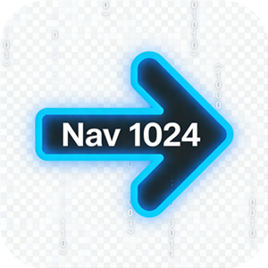

# 写在前面
一直想做个自己的导航页，不用进后台管理界面，首页触发关键词，即可进入编辑，添加网页，删除网页，简单，方便，好用，当然得感谢AI，让想法变成现实，简单的不要不要的😄
本来想做一个纯html的导航也，不用php，但是想要一个bing的每日壁纸作为banner，还想检查死链，自动获取网站的logo，最终妥协了，不过好在php部署也非常简单，数据存储用json格式，可导入可导出，基本想到的功能都有了。
（进入编辑模式，看这一行就够了：搜索框输入edit，弹出输入密码的框，输入admin123，即可进入编辑模式！）

# 导航1024

一个简洁的个人导航网站，支持深色模式、必应壁纸、网盘搜索等功能。



## 功能特性

- 🌙 **深色模式** - 一键切换亮色/暗色主题，自动保存偏好
- 🖼️ **必应每日壁纸** - Banner自动使用必应每日壁纸
- 🔍 **全文搜索** - 站内搜索 + 外部搜索引擎
- 🔍 **网盘搜索** - 一键跳转到网盘资源搜索（快捷键 Ctrl+Enter）
- 🔍 **死链检测** - 批量检查链接有效性
- 🕒 **最近访问** - 侧边栏显示最近访问的网址
- 👆 **移动端滑动手势** - 左右滑动切换分类
- 🔗 **分享功能** - 移动端原生分享，桌面端复制链接
- 📱 **响应式设计** - 完美适配手机和电脑
- ➕ **可视化编辑** - 无需修改代码即可管理网址
- 📤 **导出/导入** - 支持数据备份和恢复

## 快速开始

### 环境要求

- PHP 7.4+
- Web服务器（Nginx/Apache/IIS）

### 安装步骤

1. **克隆或下载项目**

```bash
git clone https://github.com/yourusername/nav1024.git
```

2. **配置Web服务器**

将项目目录配置为Web根目录，或将文件放到现有PHP环境的网站目录。

3. **访问网站**

打开浏览器访问 `http://your-domain.com`

### 默认配置

- 编辑触发密码：`edit`
- 管理员密码：`admin123`

**⚠️ 首次使用请修改密码！**

## 使用指南

### 进入编辑模式

1. 在搜索框输入 `edit`
2. 输入管理员密码
3. 点击右上角的编辑控制面板

### 添加新网址

1. 进入编辑模式
2. 点击「➕ 增加新网址」
3. 输入网址，按回车自动获取标题、描述
4. 填写分类后点击「确认添加」
5. 点击「💾 保存修改」

### 配置网盘搜索

1. 进入编辑模式
2. 点击「🔍 网盘搜索设置」
3. 填写网盘搜索地址和参数名称
4. 保存设置

## 配置文件说明

编辑 `config.php` 修改基础配置：

```php
// 管理员密码
define('ADMIN_PASSWORD', 'admin123');

// 编辑触发字符串
define('EDIT_TRIGGER_KEY', 'edit');

// 网站标题
define('SITE_TITLE', '导航1024');

// Banner图片（留空使用必应壁纸）
define('BANNER_IMAGE', '');

// Banner标题
define('BANNER_TITLE', '欢迎使用导航1024');

// Banner副标题
define('BANNER_SUBTITLE', '这里精选了一些优秀的网站');

// 版权信息
define('COPYRIGHT_TEXT', '© 2026 导航1024. All rights reserved.');


## 数据格式

导航数据保存在 `data/data.json`：

```json
[
  {
    "id": 1,
    "title": "网站标题",
    "url": "https://example.com",
    "desc": "网站描述",
    "category": "分类名称"
  }
]
```

## 技术栈

- **前端**: HTML5, CSS3, JavaScript (原生)
- **后端**: PHP 7.4+
- **API**: 必应 (壁纸)

## 浏览器支持

- Chrome/Edge 80+
- Firefox 75+
- Safari 13+
- IE 11 (基础支持)

## 开源协议

MIT License - See [LICENSE](./LICENSE)

## 贡献指南

欢迎提交 Issue 和 Pull Request！

---

**版本**: v2.2
**更新日期**: 2026-04-16
